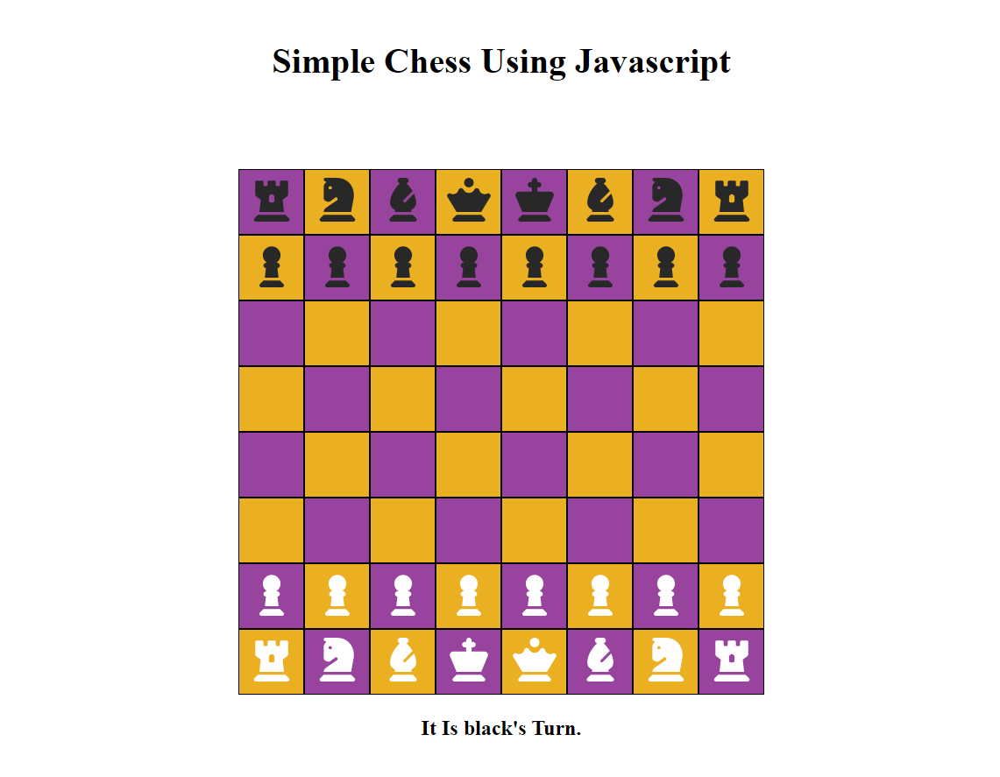

<h1 align="center">Simple JavaScript Chess Game</h1>

  <em>Play chess right in your browser with this minimalist JavaScript chess game.</em>

  

## Play Chess Here [Simple Chess](https://sahilm2063.github.io/Simple-Chess-Using-Javascript/)

## 🚀 Introduction

Welcome to the Simple JavaScript Chess Game project! This is a lightweight implementation of a chess game using only HTML, CSS, and JavaScript. It's designed to provide a straightforward chess-playing experience without the complexities of advanced features. Whether you're looking for a basic chess game or a starting point to build upon, this project has you covered.

## 🛠️ Getting Started

To get started with the Simple JavaScript Chess Game, follow these steps:

1. Clone or download the repository to your local machine.
2. Open the `index.html` file in your __Microsoft Edge__(required) browser.
3. The chessboard will be displayed, ready for you to start playing.

## 🎮 How to Play

1. Open the game in your web browser.
2. Drag a chess piece to select.
3. Drop om a valid place. (you can only place piece on valid spot according to piece.) 
4. The game doesn't include advanced features like check detection, checkmate, move highlightation or pawn promotion.

Remember, this project is designed to be a simple implementation of chess, without complex rules or interactions.

## 🤝 Contributing

Contributions to this project are not only welcome but encouraged! If you have ideas for improvements, want to fix bugs, or want to add more features while maintaining the project's simplicity, please feel free to submit a pull request.

## 🙏 Thank You

Thank you for checking out the Simple JavaScript Chess Game project! If you have any questions, feedback, or just want to connect, feel free to reach out to me:

- **Name:** Sahil Makadia
- **Email:** makadiasahil9846@gmail.com

---

Happy coding and playing! 🎲
